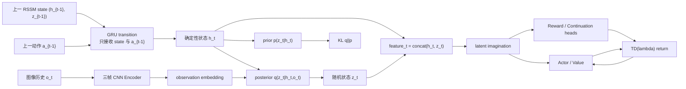

# Dreamer-like：多帧观测 Dreamer v1 世界模型

`dreamer_like` 实现 Dreamer v1 风格的图像世界模型。模型使用 RSSM（确定性 recurrent state + stochastic state）、actor、value、continuation 和 latent imagination；observation 使用连续 3 帧图像历史。

训练循环的完整执行顺序、数据对齐和参数更新范围见 [TRAINING_LOGIC.md](TRAINING_LOGIC.md)。

## 运行框架



## Observation Encoder

Encoder 输入固定为：

```text
obs_history:    [B, 3, C, H, W]
obs_valid_mask: [B, 3]
```

padding 位置先由 `obs_valid_mask` 清零，然后沿 channel 维拼接：

```text
[B, 3, C, H, W] -> [B, 3*C, H, W]
```

拼接结果经过多层 stride-2 CNN 和 `Flatten + Linear` 得到 observation embedding：

```text
observation_t: [B, observation_dim]
```

episode 开头不足 3 帧的位置使用零值左 padding，不重复第一帧。

## RSSM Posterior 与 Prior

RSSM 状态由确定性循环状态和随机状态组成：

```text
s_t = (h_t, z_t)
```

对每个时间步按顺序执行：

```text
h_t = GRU(h_{t-1}, [z_{t-1}, a_{t-1}])
p(z_t | h_t)       = prior(h_t)
q(z_t | h_t, o_t)   = posterior(h_t, observation_t)
z_t ~ q(z_t | h_t, o_t)
```

真实数据使用 posterior state，KL 项约束 posterior 接近 prior。观测 `o_t` 只进入 posterior，不进入 deterministic transition。想象阶段不读取真实下一帧，只使用 prior 采样下一随机状态。

## Latent Imagination

RSSM feature 仅表示确定性状态和随机状态的拼接：

```text
feature_t = concat(h_t, z_t)
feature_t: [B, rssm_hidden_dim + rssm_stochastic_dim]
```

它不是额外维护的状态，也不是 observation embedding；actor、value、reward
和 continuation head 使用这个拼接结果作为输入。

从最后一个 posterior state 开始，actor 在 latent space 中生成 action：

```text
s_0 = posterior_state[-1]

for k in range(H):
    a_k ~ Actor(h_k, z_k)
    s_{k+1} ~ p(s_{k+1} | s_k, a_k)
    r_k = RewardHead(s_{k+1}, a_k)
    c_k = ContinuationHead(s_{k+1})
    v_k = Value(s_{k+1})
```

Actor 输出经过 `tanh`，对应环境的 `[-1, 1]` action 范围。`continuation` 是 episode 尚未结束的概率，用作 imagined return 的 discount gate。

## Heads 与 Action Score

### Observation Head

Observation decoder 将随机 latent 映射回对应的 3-frame window：

```text
z_t -> observation_hat_history_t
observation_hat_history_t: [B, 3, C, H, W]
```

### Reward Head

Reward Head 使用 RSSM feature 和当前 action 预测 transition reward：

```text
r_hat_t = RewardHead(concat(h_t, z_t), a_t)
r_hat_t: [B, 1]
```

对于 replay transition，时间语义为：

```text
s_t --a_t--> s_{t+1}, r_t
```

### Value 与 TD(lambda)

Dreamer v1 使用 continuation 和 value bootstrap 计算 TD(lambda) 目标：

```text
G_k = r_k + gamma * c_k * ((1 - lambda) * V_{k+1} + lambda * G_{k+1})
```

actor 最大化 `G_k`，value 回归到 `stop_gradient(G_k)`。这里没有 particle planner 或 terminal Q bootstrap。

## Padding 与 Mask

图像历史使用零值左 padding：

```text
images:     [PAD o0 o1]
image mask: [ 0  1  1]
```

mask 在进入 CNN 前显式清零 padding 值。训练 batch 的 transition 由 rollout 的有效长度决定，episode 尾部的无效时间步不会参与损失。

## 训练时间对齐

`EpisodeBatch` 中的图像数据布局为 `[B,T+1,H,W,C]`。训练入口会转换为 channel-first，并将整数图像按 dtype 最大值归一化到 `[0,1]`。

每个 transition 的对齐关系为：

```text
3-frame history ending at o_t       -> observation_t -> posterior state s_t
s_t + a_t                           -> RSSM prior state s_{t+1}
RewardHead(s_t, a_t)                -> r_t
```

实现中 `frames[:, t]` 与 `actions[:, t]`、`rewards[:, t]` 保持同一 transition 时间轴；开头的历史 padding 只通过 mask 标记，不重复真实帧。

## 损失函数

### RSSM KL 损失

```text
L_KL(t) = KL(q(z_t | h_t, o_t) || p(z_t | h_t))
```

### 图像重建损失

posterior state 的随机 latent 经过 decoder 重建对应图像历史：

```text
L_obs(t) = mean((Decoder(z_t) - observation_history_t)^2)
```

### Reward 损失

```text
L_reward(t) = (RewardHead(s_t, a_t) - r_t)^2
```

### Behavior 损失

从 posterior state 进行 prior imagination 后，计算 actor 和 value 损失：

```text
L_actor = -mean(G_k)
L_value = mean((V(s_k) - stop_gradient(G_k))^2)
```

一次优化步骤将 world-model、actor 和 value loss 合并，并使用一个 Adam 优化器更新全部在线参数。

## API 示例

```python
from dreamer_like import DreamerV1, WorldModelConfig

model = DreamerV1(
    WorldModelConfig(
        observation_shape=(3, 128, 128),  # C, H, W
        action_shape=(1,),
    )
)

losses = model.loss(
    frame_history,  # [B, T, 3, C, H, W]
    frame_mask,     # [B, T, 3]
    actions,        # [B, T, action_dim]
    rewards,        # [B, T, 1]
)
losses.total.backward()
```
