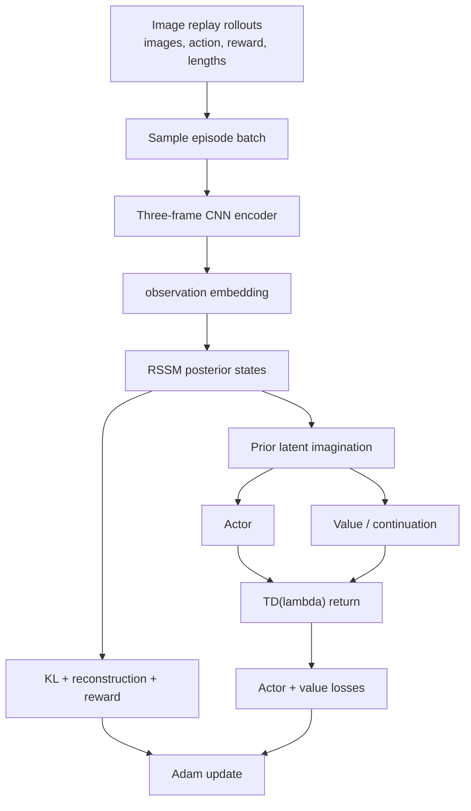

# Dreamer v1 Training Logic

本文说明 `dreamer_like` 当前训练入口 `python -m dreamer_like.train` 的实际执行逻辑。它使用多帧图像 replay 训练 RSSM world model，并在 latent space 中进行 Dreamer v1 imagination。

## 总览



## 输入数据与时间对齐

每个 batch 使用连续 episode 片段：

```text
frames:  [B, T, 3, C, H, W]
mask:    [B, T, 3]
actions: [B, T, A]
rewards: [B, T, 1]
```

`EpisodeBatch` 的原始图像为 `[B,T+1,H,W,C]`。训练入口转换为 `[B,T+1,C,H,W]`，并为每个状态构造 ending at `o_t` 的三帧历史。episode 开头不足三帧时左侧补零，由 mask 标识无效帧。

transition 的时间语义为：

```text
history ending at o_t -> posterior state s_t
s_t + a_t -> state transition -> s_{t+1}, r_t, o_{t+1}
```

不会将未来真实 observation 输入 imagination，也不会把 padding transition 计入损失。

## Observation 编码

每个时间步的图像历史沿 channel 维拼接，再经过 CNN：

```text
[B, T, 3, C, H, W]
-> [B*T, 3*C, H, W]
-> [B*T, observation_dim]
```

padding 帧在进入 CNN 前由 `mask` 清零。CNN 输出 observation embedding，不是最终随机 latent。

## RSSM Posterior

RSSM 状态由两部分组成：

```text
h_t: 确定性循环状态
z_t: 随机状态
```

每个时间步依次执行：

```text
h_t = GRU(h_{t-1}, [z_{t-1}, a_{t-1}])
p(z_t | h_t)     = prior(h_t)
q(z_t | h_t,o_t) = posterior(h_t, observation_t)
z_t ~ q(z_t | h_t,o_t)
```

world-model 使用 posterior state 重建图像并预测 reward；KL 将 posterior regularize 到 prior。观测只进入 posterior，不进入 GRU transition。prior 和 posterior 的 log standard deviation 在数值上限制在固定范围内，以保持采样稳定。

## Latent Imagination

代码中的 RSSM feature 定义为状态两部分的拼接，而不是额外的状态变量：

```text
feature_t = concat(h_t, z_t)
```

它作为 actor、value、reward 和 continuation head 的输入。

行为学习从最后一个 posterior state 开始：

```text
s_0 = posterior_state[-1]

for k in range(H):
    a_k ~ Actor(s_k)
    s_{k+1} ~ p(s_{k+1} | s_k, a_k)
    r_k = RewardHead(s_{k+1}, a_k)
    c_k = ContinuationHead(s_{k+1})
    v_k = Value(s_{k+1})
```

rollout 只读取 prior 和 actor，不读取真实下一帧。actor 输出经过 `tanh`，对应环境的 `[-1,1]` action 范围。

## 损失与参数更新

单次更新的损失为：

```text
L_KL          = mean(KL(q(z|h,o) || p(z|h)))
L_observation = mean((Decoder(z_t) - frame_history_t)^2)
L_reward      = mean((RewardHead(s_t,a_t) - r_t)^2)
L_world       = L_KL + L_observation + L_reward
```

想象 trajectory 使用 TD(lambda)：

```text
G_k = r_k + gamma * c_k * ((1-lambda) * V_{k+1} + lambda * G_{k+1})
L_actor = -mean(G_k)
L_value = mean((V(s_k) - stop_gradient(G_k))^2)
```

`L_world + L_actor + L_value` 使用一个 Adam 优化器更新 encoder、RSSM、decoder、reward/continuation head、actor 和 value。value target 使用 stop-gradient，RSSM prior imagination 本身仍允许 actor/value 所需的梯度路径。

## 训练入口

```bash
python -m dreamer_like.train \
  --data-dir dataset/fetch-pick-and-place-random \
  --steps 1000 --batch-size 1 --horizon 16 --device cuda \
  --output runs/dreamer_like/checkpoint.pt
```

`batch-size` 表示从离线数据中采样的 rollout batch 数；`horizon` 同时限制真实序列训练长度和 imagined trajectory 长度。checkpoint 保存模型参数和 `WorldModelConfig`，不包含旧版 pretraining、EMA 或 particle planner 状态。

## 参数更新归属

| 训练阶段 | 数据来源 | 直接优化参数 |
| --- | --- | --- |
| World-model update | 多帧 image replay | CNN encoder、RSSM、image decoder、reward/continuation head |
| Behavior update | RSSM prior imagination | Actor、Value，以及 imagination 路径上的 RSSM/reward 参数 |

Dreamer v1 的 imagination 不使用真实未来 observation，也不使用 particle policy、CEM、EMA target 或 action-history latent encoder。
