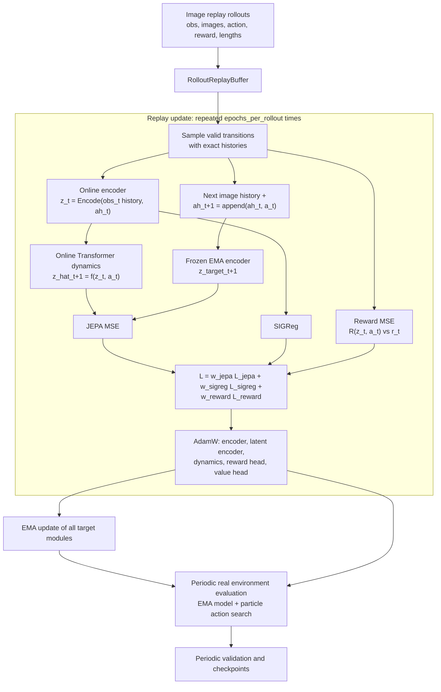
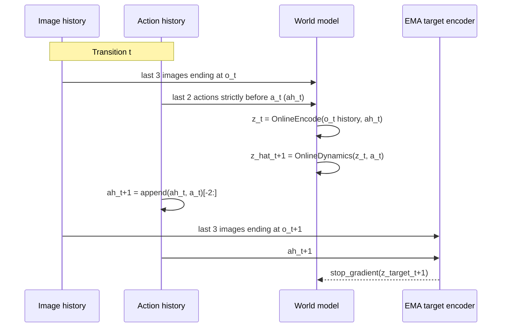

# TD-MPC-like Training Logic

本文说明 `tdmpc_like` 当前训练入口 `python -m tdmpc_like.train` 的实际执行逻辑。它使用 replay 训练 world model，并在真实环境中只做周期性评估。

## 总览



一次外层训练单元（CLI 的 `rollout`）只进行多次 replay transition 更新；真实环境 episode 只在 checkpoint 周期用于评估，不参与梯度更新。

## 预训练阶段

`run_pretrain_tdmpc_like.sh` 通过 `--pretrain` 进入纯 world-model 阶段。该阶段直接从 `DATA_DIR` 将源 rollout 加载到 RAM，不会在输出目录复制 replay 文件；随后按 epoch 打乱全部离线 transition，并以无放回 minibatch 完整遍历一次数据。它不会创建 Gym 环境或执行 particle policy。

预训练使用固定 validation batch 的 `total` loss 选择 `checkpoint_best.pt`，并保留最近两个带 epoch 编号的 checkpoint。`RESUME` 用于恢复同一预训练阶段的完整 optimizer、epoch 计数器和 RNG 状态；正式训练则通过 `PRETRAINED_CHECKPOINT` 只加载预训练模型参数，并使用新的 optimizer、rollout 计数、best return 和 RNG 状态。预训练 checkpoint 与正式训练 checkpoint 分别标记为 `phase=pretrain` 和 `phase=training`，不能混用 `RESUME`。

## 模型与参数副本

在线模块是 `encoder`、`latent_encoder`、`dynamics` 和 `heads`。状态表征与预测关系为：

```text
obs_history_t [B, 3, C, H, W] --CNN--> observation_t
ah_t          [B, 2, A]       --mask/flatten-->

z_t = LatentEncoder(observation_t, ah_t)          # [B, 128]
z_hat_{t+1} = TransformerDynamics(z_t, a_t)       # [B, 128]
```

`dynamics` 内部将 128 维 `z_t` 和当前 action 分别线性投影到 `model_dim`，组成固定的两个 token，经过 Transformer 后读取第一个 token 并投影回 128 维。它不再次接收 `ah_t`，因为 action history 已经构成当前 `z_t` 的一部分。

模型初始化时为每个在线模块创建一个冻结的 EMA 副本：`ema_encoder`、`ema_latent_encoder`、`ema_dynamics` 和 `ema_heads`。每次任一 optimizer step 后，所有 EMA 参数更新为：

```text
theta_ema <- target_ema * theta_ema + (1 - target_ema) * theta_online
```

默认的公开推理接口，例如 `encode` 和 `predict_next`，使用 EMA 模块且禁用梯度；训练损失显式调用 `encode_online` 与 `predict_next_online`。

## Replay 数据与时间对齐

训练数据是完整 episode，但一次 replay update 会从有效 transition 中均匀采样 `batch_size` 个 `(episode, t)`。每个样本构造以下左侧零填充窗口：



因此不会把 `a_t` 错当为构造 `z_t` 的历史的一部分，也不会在 target 分支遗漏 `a_t`。episode 开头不足 3 帧图像或 2 个 action 的位置为零，并由对应 boolean mask 标识；mask 进入 encoder 前会将 padding 值清零。

## Replay World-Model Update

`train_transitions` 更新在线 encoder、latent encoder、Transformer dynamics、reward head 和 value head。完整损失是：

```text
L_JEPA   = mean((z_hat_{t+1} - stopgrad(z_target_{t+1}))^2)
L_reward = mean((RewardHead(z_t, a_t) - r_t)^2)
Q_target = r_t + gamma(1-d_t) min(Q1_target, Q2_target)(z_{t+1}, a_{t+1})
L_value  = mean_i((Qi(z_t, a_t) - Q_target)^2)
L_SIGReg = Gaussian-distribution regularization on online z_t and z_{t+1}

L_world = jepa_weight * L_JEPA
        + sigreg_weight * L_SIGReg
        + reward_weight * L_reward
        + value_weight * L_value
```

`z_target_{t+1}` 仅由 EMA observation encoder 和 EMA latent encoder 得到，因此 JEPA 的 target 分支没有梯度。为了计算 SIGReg，代码还会在线编码真实的 `z_{t+1}`；这不是 dynamics 的 target，也不改变 JEPA 的 stop-gradient 语义。

SIGReg 从在线 latent 采样随机单位方向，比较投影后的经验特征函数与标准高斯的特征函数，用于避免所有输入坍塌到相同 latent。默认 `sigreg_weight` 为 `0.2`。

反向传播后，训练器可按 `grad_clip_norm` 裁剪梯度，执行 world optimizer，并立即更新 EMA 模块。

## 外层训练循环

默认训练入口的一个外层单元可写为：

```text
current_batch = replay_buffer.sample(sample_rollouts)

repeat epochs_per_rollout times:
    sample batch_size valid transitions from current_batch
    train_transitions(...)

```

`sample_rollouts` 决定一次 replay batch 合并的 episode/rollout 数，`epochs_per_rollout` 决定对此 batch 进行多少次随机起点更新。每个起点按唯一的 `PLANNING_HORIZON` 递归预测连续多步，所有有效预测步等权归一化；同一参数也控制粒子搜索的 reward horizon，搜索分数是 discounted reward sum 加 terminal clipped double-Q，默认 horizon 为 20。

## 验证与 Checkpoint

训练开始时会从 replay buffer 固定抽取一个 `validation_batch`。默认每 10 个外层单元（以及最后一次）会：

1. 用固定 seed 将 validation batch 的全部有效 transition 无放回遍历一遍，并在 `inference_mode` 下按 minibatch 计算、加权汇总 replay 损失。
2. 在真实环境独立运行 10 个评估 episode，计算平均 `evaluation_return`；这些 episode 不用于训练。
3. 保存带 rollout 编号的 checkpoint，只保留最近两份。checkpoint 包含 online 与 EMA 参数、optimizer 状态、模型/训练配置、best 状态，以及 replay、策略、评估、CPU 和 CUDA 随机数状态。
4. 若 `evaluation_return` 严格优于历史最佳值，额外保存 `checkpoint_best.pt`。

因此 validation loss 被记录用于观察 replay 表现，而 best checkpoint 的选择指标是独立评估的平均 `evaluation_return`，不是 validation total loss。评估结果不会缩短训练，online 阶段始终执行到指定的 `rollouts`。`--resume` 可指定具体 checkpoint 或运行目录；目录模式自动选择编号最大的 checkpoint。

## 参数更新归属

| 训练阶段 | 数据来源 | 直接优化参数 | 不直接优化参数 |
| --- | --- | --- | --- |
| Pretrain replay update | 随机 policy 离线 image rollout | Observation encoder、Latent encoder、Transformer dynamics、Reward head、Value head | 全部 EMA 模块 |
| Formal replay update | 离线 image rollout | Observation encoder、Latent encoder、Transformer dynamics、Reward head、Value head | 全部 EMA 模块 |
| EMA update | 在线参数快照 | 无梯度参数滑动平均 | 不适用 |

EMA 模块从不通过反向传播更新；它们仅由每次 optimizer step 后的滑动平均得到。

评估和对外 policy API 使用 EMA 副本：`encode`、`predict_next`、`predict_heads`、`evaluate_action`、`rollout` 以及粒子搜索中的 dynamics/reward/value 都不会读取在线模块。在线模块只用于训练 loss。
