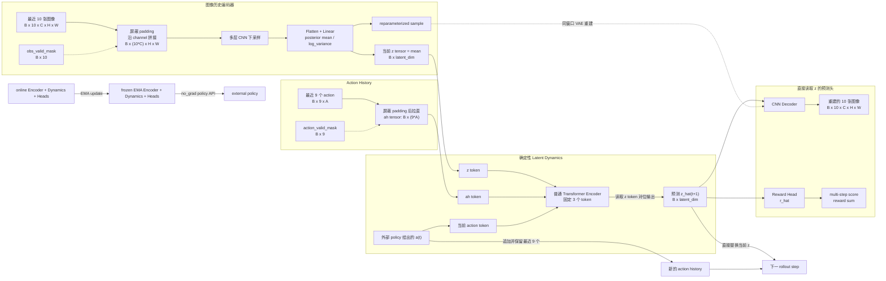

# Trans-WM：图像历史 Transformer 世界模型

`trans_wm` 实现一个与 policy 完全解耦的图像 Transformer world model。当前结构不维护 latent history，也不包含生成式 dynamics、RSSM prior/posterior、actor、CEM 或 MPC。VAE posterior 和 KL 只用于稳定 CNN 图像表征。

模型只维护两个状态：

- 当前图像历史编码得到的 `z tensor`；
- 最近 9 个已执行 action 组成的 action history。

外部 policy 给出当前 action 后，Dynamics 直接预测确定性的下一个 `z tensor`。Heads 从 latent 预测 observation，并从当前 latent 与 action 预测 reward；模型不包含 Value head。

## 运行框架



## Observation Encoder

Encoder 输入固定为：

```text
obs_history:    [B, 10, C, H, W]
obs_valid_mask: [B, 10]
```

10 张图像首先沿 channel 维拼接：

```text
[B, 10, C, H, W] -> [B, 10*C, H, W]
```

拼接结果经过多层 stride-2 CNN 压缩，再拉直并通过 Linear 得到 VAE posterior 的 mean 和 log-variance。在线任务使用 posterior mean 作为确定性的 `z_t`：

```text
z_t: [B, latent_dim]
```

Encoder 只输出当前一个 `z_t`。episode 开头不足 10 帧的位置使用零 padding，且在拼接前用 `obs_valid_mask` 清零，不重复第一帧。

训练时还会从同一个 posterior 重参数采样，并要求 CNN Decoder 重建产生该 posterior 的同一个 10-frame window。

## Action History

最近 9 个 action 只用于构造一个整体的 `ah tensor`：

```text
action_history: [B, 9, action_dim]
ah tensor:      [B, 9 * action_dim]
```

padding action 会先由 `action_valid_mask` 清零再拉直。`predict_next` 同时支持传入原始 `[B,9,A]` history，或者直接传入已经拼好的 `[B,9*A]` `ah tensor`。

模型不维护 `z_{t-9:t}`，也没有 append latent history 的过程。rollout 时只执行：

```text
z <- z_hat_next
action_history <- append(action_history, executed_action)[-9:]
```

## Latent Dynamics

Dynamics 是普通的确定性 Transformer Encoder。输入序列始终只有三个 token，并保持以下顺序：

```text
1. z_t token
2. ah_t token
3. current action a_t token
```

三个输入 tensor 分别经过独立 Linear projection 映射到 `model_dim`，加上三个位置 embedding 后进入 Transformer。最终只读取 `z_t` token 对应位置的输出，并映射成：

```text
z_hat_{t+1}: [B, latent_dim]
```

这里没有均值、方差、noise、sampling 或 generative rollout。相同输入始终产生相同 `z_hat_{t+1}`。

## Heads 与 Action Score

Observation Head 和 Reward Head 都直接读取单个当前 `z tensor`，不读取 latent history。

### Observation Head

Observation Head 将 `z_t` 映射回 CNN feature map，再通过转置卷积重建 Encoder 对应的整组 10 张图像：

```text
z_t -> observation_hat_history_t

observation_hat_history_t: [B, 10, C, H, W]
```

### Reward Head

Reward Head 输出该状态对应的当前 transition reward：

```text
reward_hat: [B, 1]
```

对于 replay 数据中的 transition：

```text
z_t --a_t--> z_{t+1}, reward r_t
```

训练和 rollout 都直接使用 `(z_t, a_t)` 预测 `r_t`：

```text
r_hat_t = RewardHead(z_t, a_t)
```

这与 Pendulum 在状态积分前由当前状态和 action 计算 reward 的时间语义一致。

### Action Score

外部 policy 的 action 先经过 Dynamics 得到下一个状态，再通过 Heads 计算分数：

```text
z_hat_{t+1} = Dynamics(z_t, ah_t, a_t)

score(a_t:t+H-1)
    = sum_k reward_hat(z_t+k, a_t+k)
```

规划器使用 EMA dynamics rollout 候选动作序列，直接累加多步预测 reward；不折扣，也不添加 terminal value。

## Padding 与 Mask

图像历史和 action history 都使用零值左 padding：

```text
images:     [PAD PAD PAD PAD PAD PAD PAD o0 o1 o2]
image mask: [ 0   0   0   0   0   0   0  1  1  1]

actions:    [PAD PAD PAD PAD PAD PAD PAD a0 a1]
action mask:[ 0   0   0   0   0   0   0  1  1]
```

训练时还使用 `transition_valid` 排除 batch 中 episode 结束后的无效 transition。

## 训练时间对齐

`EpisodeBatch` 中的图像数据布局为 `[B,T+1,H,W,C]`。训练器会自动转换为 `[B,T+1,C,H,W]`，整数图像还会按 dtype 最大值归一化到 `[0,1]`。

每个 transition 的对齐关系是：

```text
10-frame history ending at o_t     -> z_t
10-frame history ending at o_{t+1} -> z_{t+1}

Dynamics(z_t, ah_t, a_t) -> z_hat_{t+1}
ObservationHead(z_t)      -> 10-frame history ending at o_t
RewardHead(z_t, a_t)      -> r_t
```

## 损失函数

### 图像重建损失

Dynamics 产生的 `z_hat_{t+1}` 通过 Observation Head 重建下一时刻的完整 10-frame history：

```text
L_obs(t) = mean((observation_hat_history(z_hat_{t+1}) - observation_history_{t+1})^2)
```

### Reward 损失

```text
L_reward(t) = (reward_hat(z_{t+1}) - r_t)^2
```

### 同窗口 VAE 辅助任务

Encoder 对每一个 10-frame window 输出 VAE posterior：

```text
q(z | window) = Normal(mean, exp(log_variance))
z_sample = mean + exp(0.5 * log_variance) * epsilon
```

同一个 window 的 `z_sample` 立即交给 CNN Decoder 重建同一个 window，不会拿另一个时间窗口作为 VAE reconstruction target：

```text
L_vae_recon = mean((Decoder(z_sample) - window)^2)
L_vae_kl = -0.5 * mean(1 + log_variance - mean^2 - exp(log_variance))
```

这项辅助任务持续更新 CNN Encoder/Decoder，保护图像表征稳定。Dynamics 不再使用 `z_hat` 与 encoder latent 之间的 NLL、MSE 或任何直接 latent matching 约束；它通过下一窗口 observation 任务获得训练信号，Reward Head 则从当前 latent 与 action 学习 transition reward。

EMA 参数在每次训练更新后更新，覆盖 Encoder、Dynamics 和全部 Heads：

```text
theta_target = ema * theta_target + (1 - ema) * theta_online
```

默认 `ema = 0.99`。

### 总损失

训练从每个采样起点按唯一的 `PLANNING_HORIZON` 递归展开 Dynamics，默认 10 步。第 `k+1` 步使用第 `k` 步预测 latent，而不是重新编码真实状态作为 Dynamics 输入。所有有效预测步等权并按有效预测总数归一化；episode 尾部不足 horizon 的部分由 mask 排除。

所有 loss 先在有效 rollout step/window 上做 masked mean，再按配置权重相加：

```text
L_total =
    observation_weight * L_obs
    + reward_weight * L_reward
    + vae_reconstruction_weight * L_vae_recon
    + vae_kl_weight * L_vae_kl
```

默认 `vae_reconstruction_weight = 1.0`，`vae_kl_weight = 1e-4`。

## Policy 使用 EMA 模型

默认公共 API `encode`、`predict_next`、`predict_heads`、`evaluate_action` 和 `rollout` 已直接绑定 EMA 模型，并全部禁用梯度。显式 `_ema` API 与它们等价：

```python
z_t = model.encode(obs_history, obs_valid_mask)
z_next = model.predict_next(z_t, action_history, action)
heads = model.predict_heads(z_next, action)
evaluation = model.evaluate_action(z_t, action_history, action)
rollout = model.rollout(z_t, action_history, external_actions)
```

这些 API 使用冻结的 `ema_encoder`、`ema_dynamics` 和 `ema_heads`，不会把 policy 的推理计算图连接到在线训练参数。只有训练器会显式调用 `encode_online`、`predict_next_online` 和 `predict_heads_online`。

## API 示例

```python
from trans_wm import WorldModel, WorldModelConfig, WorldModelTrainer

model = WorldModel(
    WorldModelConfig(
        observation_shape=(3, 128, 128),  # C, H, W
        action_shape=(1,),
        latent_dim=128,
    )
)

# 训练。
trainer = WorldModelTrainer(model)
metrics = trainer.train_batch(replay_buffer.sample())

# 默认 API 已使用 EMA encoder。
z_t = model.encode(obs_history, obs_valid_mask)

# 构造一个 ah tensor，也可以让 predict_next 内部完成该操作。
ah_t = model.action_history_tensor(action_history, action_valid_mask)
z_next = model.predict_next(z_t, ah_t, action)

# 直接从 z 预测 10 张图像，并从 (z, action) 预测 reward。
heads = model.predict_heads(z_t, action)

# 预测 action-conditioned next state 及当前 transition reward。
evaluation = model.evaluate_action(
    z_t,
    action_history,
    action,
    action_valid_mask,
)
reward_score = evaluation.score

# 对外部 action sequence rollout，只维护 action history。
rollout = model.rollout(
    z_t,
    action_history,
    external_actions,  # [B, horizon, *action_shape]
    action_valid_mask,
)
```
