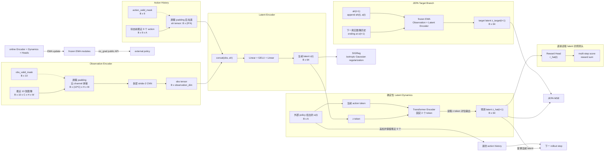

# Trans-WM-LE：图像历史 JEPA Transformer 世界模型

`trans_wm_le` 实现一个与 policy 完全解耦的 action-conditioned latent JEPA world model。模型不包含图像 decoder、VAE、生成式 dynamics、RSSM prior/posterior、actor、CEM 或 MPC。

训练循环的完整执行顺序、数据对齐和参数更新范围见 [TRAINING_LOGIC.md](TRAINING_LOGIC.md)。

模型将表示明确分成两层：

- 最近 10 帧图像经过 CNN 得到 `obs tensor`；
- `obs tensor` 与最近 9 个已执行 action 组成的 `ah tensor` 经过小型 MLP，得到固定 64 维 `latent state`。

外部 policy 给出当前 action 后，Transformer Dynamics 根据当前 latent 和 action 预测下一个 latent。训练时，预测 latent 通过 JEPA loss 对齐由下一真实 observation 和更新后 action history 编码得到的 EMA target latent，并使用 SIGReg 防止表示坍塌。

## 运行框架



## Observation Encoder

Observation Encoder 输入固定为：

```text
obs_history:    [B, 10, C, H, W]
obs_valid_mask: [B, 10]
```

padding 位置先由 `obs_valid_mask` 清零，然后 10 张图像沿 channel 维拼接：

```text
[B, 10, C, H, W] -> [B, 10*C, H, W]
```

拼接结果经过多层 stride-2 CNN，再通过 `Flatten + Linear` 得到：

```text
obs_tensor_t: [B, observation_dim]
```

这里的输出只是由图像历史得到的 observation representation，不再称为 `z tensor`。Encoder 是确定性的，不输出 mean、log-variance，也不进行 sampling。

episode 开头不足 10 帧的位置使用零值左 padding，不重复第一帧。

## Action History

状态 `t` 的 action history 只包含 `a_t` 之前已经执行的 action：

```text
action_history_t: [B, 9, action_dim]
action_valid_mask: [B, 9]
```

padding action 先由 `action_valid_mask` 清零，再拉直为一个整体的 `ah tensor`：

```text
ah_t: [B, 9 * action_dim]
```

`action_history_tensor` 支持传入原始 history 和 mask。`encode` / `encode_online` 既支持原始 `[B,9,A]` history，也支持已经拉直的 `[B,9*A]` tensor；传入拉直 tensor 时不再额外传 mask。

下一状态的 action history 必须包含当前 transition 的 action：

```text
ah_{t+1} = append(ah_t, a_t)[-9:]
```

这一步同时用于真实下一 latent 的 JEPA target 编码，不能继续使用 `ah_t`，否则 observation 与 action history 会错位。

## Latent Encoder

新的 latent state 由 `obs tensor` 和 `ah tensor` 共同构造：

```text
input_t = concat(obs_tensor_t, ah_t)

z_t = Linear(
        GELU(
            Linear(input_t)
        )
      )

z_t: [B, 64]
```

`latent_dim` 在 `trans_wm_le` 中固定为 64，配置为其他值会直接报错。`observation_dim` 与 `model_dim` 仍可配置。

模型只维护当前一个 latent，不维护 `z_{t-9:t}` 或其他 latent history。

## Latent Dynamics

Dynamics 是确定性的 Transformer Encoder，只读取当前 latent 和当前 action。输入序列固定为两个 token：

```text
1. z_t token
2. current action a_t token

z_hat_{t+1} = Transformer(z_t token, a_t token)[z position]

z_t:           [B, 64]
a_t:           [B, action_dim]
z_hat_{t+1}:   [B, 64]
```

Dynamics 不再读取 `ah_t`。历史 action 已经在 Latent Encoder 中进入 `z_t`，因此再次送入 Dynamics 会重复建模同一信息。

两个输入分别经过独立 Linear projection 映射到 `model_dim`，加上位置 embedding 后进入 Transformer，最后读取 `z_t` token 对应位置并映射回 64 维。这里没有概率分布、noise 或 sampling；当 `dropout=0` 时，相同输入始终产生相同的预测 latent。

## Heads 与 Action Score

模型不包含 Observation Head、图像 decoder 或 Value Head。Reward Head 读取 64 维 latent 和当前 action。

### Reward Head

对于 replay transition：

```text
z_t --a_t, r_t--> z_{t+1}
```

训练和 rollout 都从当前 latent 和当前 action 计算 reward：

```text
r_hat_t = RewardHead(z_t, a_t)
r_hat_t: [B, 1]
```

因此 `r_hat_t` 表示执行 `a_t` 所对应的 transition reward，而不是进入 `z_t` 之前的 reward。

### Action Score

外部 policy 的候选 action 先经过 Dynamics 得到下一 latent，再由两个 head 计算分数：

```text
z_hat_{t+1} = Dynamics(z_t, a_t)

score(a_t:t+H-1)
    = sum_k RewardHead(z_t+k, a_t+k)
```

规划器使用 EMA dynamics rollout 候选动作序列，直接累加多步预测 reward；不折扣，也不添加 terminal value。

## Padding 与 Mask

图像历史和 action history 都使用零值左 padding：

```text
images:      [PAD PAD PAD PAD PAD PAD PAD o0 o1 o2]
image mask:  [ 0   0   0   0   0   0   0  1  1  1]

actions:     [PAD PAD PAD PAD PAD PAD PAD a0 a1]
action mask: [ 0   0   0   0   0   0   0  1  1]
```

mask 在进入 CNN 或 Latent Encoder 前显式清零 padding 值。训练时还使用 `transition_valid` 排除 batch 中 episode 结束后的无效 transition，并使用 `state_valid` 排除 SIGReg 中的无效状态。

## 训练时间对齐

`EpisodeBatch` 中的图像通常为 `[B,T+1,H,W,C]`。训练器会转换为 `[B,T+1,C,H,W]`；整数图像还会按 dtype 最大值归一化到 `[0,1]`。

transition `t` 的精确对齐关系为：

```text
image window ending at o_t       -> obs_tensor_t
actions strictly before a_t      -> ah_t
concat(obs_tensor_t, ah_t)       -> z_t

z_t + a_t                        -> z_hat_{t+1}

image window ending at o_{t+1}   -> obs_tensor_{t+1}
append(ah_t, a_t)                -> ah_{t+1}
concat(obs_tensor_{t+1}, ah_{t+1})
                                  -> z_target_{t+1}

RewardHead(z_t, a_t)             -> r_hat_t
```

也就是：

```text
obs_t -> action_t -> obs_{t+1}
  z_t -> dynamics -> z_hat_{t+1}
                      || JEPA alignment
                    z_target_{t+1}
```

`train_batch` 在完整 episode tensor 上构造所有历史窗口并使用 mask；`train_transitions` 则采样有效起点，并构造从该起点开始、最长为 `PLANNING_HORIZON` 的连续 action/reward/目标窗口，默认 10 步。预测 latent 递归作为下一步 Dynamics 输入，真实未来窗口只用于构造 EMA target。

## 损失函数

### JEPA Latent Prediction Loss

在线分支产生当前 latent 和预测下一 latent：

```text
z_t = OnlineLatentEncoder(
    OnlineObservationEncoder(obs_history_t),
    ah_t,
)

z_hat_{t+1} = OnlineDynamics(z_t, a_t)
```

target 分支使用下一真实 observation、更新后的 `ah_{t+1}` 和冻结的 EMA encoder：

```text
z_target_{t+1} = stop_gradient(
    EMALatentEncoder(
        EMAObservationEncoder(obs_history_{t+1}),
        ah_{t+1},
    )
)
```

JEPA loss 直接最小化预测 latent 与 target latent 的逐维均方误差：

```text
L_JEPA(t) = mean((z_hat_{t+1} - z_target_{t+1})^2)
```

梯度通过 `z_hat_{t+1}` 更新在线 Observation Encoder、Latent Encoder 和 Dynamics，不通过 target 分支反传。

### SIGReg 正则项

只使用 JEPA matching 时，所有样本映射到相同 latent 也可能形成低损失解。SIGReg 用随机一维投影约束在线 latent 的分布接近各向同性标准高斯。

对于在线 latent `z_i in R^64`，采样并归一化随机方向：

```text
u_k = g_k / ||g_k||,  g_k ~ Normal(0, I)
p_ik = z_i^T u_k
```

对 `num_frequencies` 个频率计算每个投影的经验特征函数：

```text
omega_l = l * max_frequency / num_frequencies

phi_hat_k(omega_l)
    = mean_i exp(j * omega_l * p_ik)
```

标准高斯的一维特征函数为：

```text
phi_G(omega_l) = exp(-omega_l^2 / 2)
```

实现分别比较实部和虚部：

```text
L_SIGReg = mean_{k,l}(
    (Re(phi_hat_k(omega_l)) - phi_G(omega_l))^2
    + Im(phi_hat_k(omega_l))^2
)
```

默认参数为：

```text
sigreg_projections   = 256
sigreg_frequencies   = 17
sigreg_max_frequency = 5.0
```

完整序列训练对所有 `state_valid` 的在线 latent 计算 SIGReg；采样训练则对当前和 horizon 内所有有效未来在线 latent 计算 SIGReg。

### Reward Loss

```text
L_reward(t) = (RewardHead(z_t, a_t) - r_t)^2
```

第一步 Reward loss 更新 Encoder 和 Reward Head；后续步读取递归预测 latent，因此也会向 Dynamics 反传。Dynamics 同时由所有预测步的 JEPA loss 更新。

### 总损失

所有 horizon 内有效预测步等权，并按有效预测总数做 masked mean，因此增大 horizon 不会直接线性放大 loss。episode 尾部越界位置不参与更新。随后各项 loss 按配置权重相加：

```text
L_total =
    jepa_weight   * L_JEPA
    + sigreg_weight * L_SIGReg
    + reward_weight * L_reward
```

`jepa_weight` 和 `reward_weight` 默认是 `1.0`，`sigreg_weight` 默认是 `0.2`。模型没有 observation reconstruction loss、VAE reconstruction loss 或 VAE KL loss。

## EMA Target 与 Policy API

每次 optimizer step 后，EMA 参数按以下方式更新：

```text
theta_target = ema * theta_target + (1 - ema) * theta_online
```

默认 `target_ema = 0.99`。EMA 覆盖以下模块：

- Observation Encoder；
- Latent Encoder；
- Latent Dynamics；
- Reward Head。

默认公共 API `encode`、`predict_next`、`predict_heads`、`evaluate_action` 和 `rollout` 使用冻结的 EMA 模块并禁用梯度。训练器显式调用对应的在线 API。

```python
z_t = model.encode(
    obs_history,
    obs_valid_mask,
    action_history,
    action_valid_mask,
)

z_next = model.predict_next(z_t, action)
heads = model.predict_heads(z_next, action)
evaluation = model.evaluate_action(z_t, action)
rollout = model.rollout(z_t, action_history, external_actions, action_valid_mask)
```

注意：`rollout` 接收并更新 action history，是为了返回与 rollout 结束位置对齐的 history。每一步 Dynamics 本身只读取 `z` 和当前 action，不读取 action history。

## API 示例

```python
from trans_wm_le import (
    TrainingConfig,
    WorldModel,
    WorldModelConfig,
    WorldModelTrainer,
)

model = WorldModel(
    WorldModelConfig(
        observation_shape=(3, 128, 128),  # C, H, W
        action_shape=(7,),
        observation_dim=128,
        latent_dim=64,  # trans_wm_le 中固定为 64
        model_dim=256,
        num_layers=3,
        num_heads=4,
        feedforward_dim=512,
        dropout=0.0,
    )
)

trainer = WorldModelTrainer(
    model,
    TrainingConfig(
        jepa_weight=1.0,
        sigreg_weight=0.2,
        sigreg_projections=256,
        sigreg_frequencies=17,
        sigreg_max_frequency=5.0,
    ),
)

# 从 replay 中训练完整 episode batch。
metrics = trainer.train_batch(replay_buffer.sample())

# 默认 encode 使用冻结的 EMA Observation Encoder 和 Latent Encoder。
z_t = model.encode(
    obs_history,          # [B, 10, C, H, W]
    obs_valid_mask,       # [B, 10]
    action_history,       # [B, 9, action_dim]
    action_valid_mask,    # [B, 9]
)

# Dynamics 只需要当前 64D latent 和当前 action。
z_next = model.predict_next(z_t, action)

# 从当前 latent 和 action 预测 transition reward。
heads = model.predict_heads(z_t, action)
evaluation = model.evaluate_action(z_t, action)
reward_score = evaluation.score

# 对外部 action sequence rollout，同时维护并返回 action history。
rollout = model.rollout(
    z_t,
    action_history,
    external_actions,    # [B, horizon, *action_shape]
    action_valid_mask,
)
```

## 命令行训练

推荐使用仓库根目录下的运行脚本。网络结构使用 `WorldModelConfig` 中的固定配置：observation dim 128、Transformer model dim 256、3 层、4 个 attention heads、FFN dim 512、CNN channels `(32, 64, 128)`、dropout 0。训练参数可以通过环境变量覆盖：

依次执行预训练、正式训练和最终在线评估：

```bash
DEVICE=cuda PRETRAIN_EPOCHS=100 TRAIN_ROLLOUTS=500 \
./run_integrate_trans_wm_le.sh
```

```bash
./run_train_trans_wm_le.sh

ROLLOUTS=500 \
BATCH_SIZE=16 \
DEVICE=cuda \
JEPA_WEIGHT=1.0 \
SIGREG_WEIGHT=0.2 \
./run_train_trans_wm_le.sh
```

也可以直接调用 Python 训练入口：

```bash
python -m trans_wm_le.train \
    --data-dir dataset \
    --output-dir runs/trans_wm_le \
    --jepa-weight 1.0 \
    --sigreg-weight 0.2
```

数据目录需要包含 `dataset.json` 以及其中列出的 rollout `.npz` 文件。每个 rollout 文件必须包含：

```text
obs, images, action, reward, terminated, truncated, lengths
```

训练会保存模型配置、训练配置、optimizer 状态、NumPy/Torch RNG 状态以及 EMA 参数。日志指标包括：

```text
total, jepa, sigreg, reward
```
