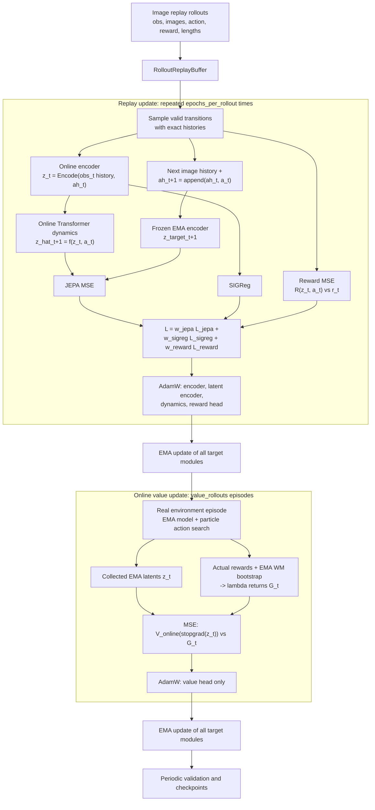
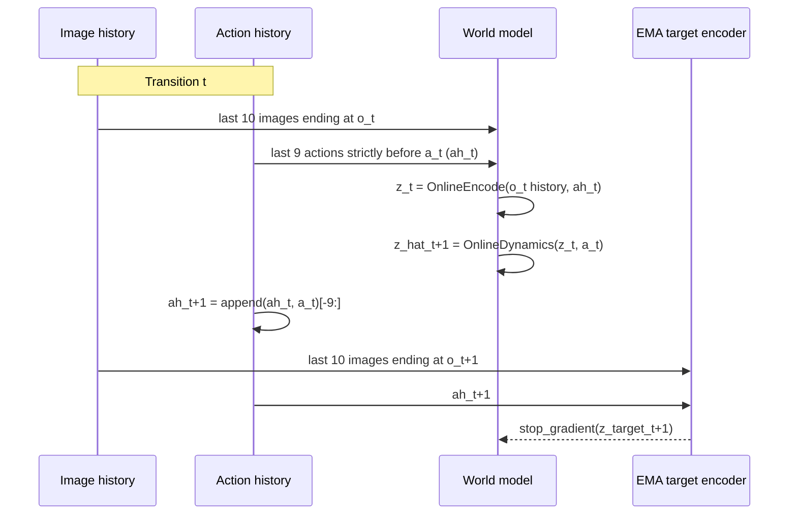
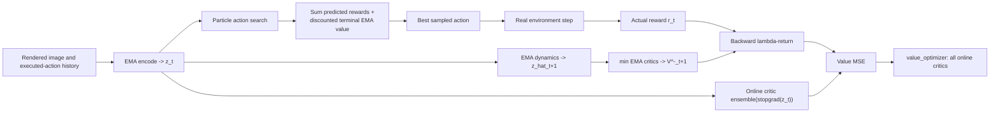

# Trans-WM-LE Training Logic

本文说明 `trans_wm_le` 当前训练入口 `python -m trans_wm_le.train` 的实际执行逻辑。它将 world model 的 replay 训练与 value head 的真实环境监督分开进行。

## 总览



一次外层训练单元（CLI 的 `rollout`）顺序为：先进行多次 replay transition 更新，再执行若干当前策略的真实环境 episode 来训练 value head。它不在 replay 数据上训练 value。

## 预训练阶段

`run_pretrain_trans_wm_le.sh` 通过 `--pretrain` 进入纯 world-model 阶段。该阶段直接从 `DATA_DIR` 将源 rollout 加载到 RAM，不会在输出目录复制 replay 文件；随后按 epoch 打乱全部离线 transition，并以无放回 minibatch 完整遍历一次数据。它不会创建 Gym 环境、执行 particle policy 或调用 `train_value_rollout`，因此 ensemble critic 不会在 encoder、dynamics 和 reward head 尚未收敛时被训练。

预训练使用固定 validation batch 的 `total` loss 选择 `checkpoint_best.pt`，并保留最近两个带 epoch 编号的 checkpoint。`RESUME` 用于恢复同一预训练阶段的完整 optimizer、epoch 计数器和 RNG 状态；正式训练则通过 `PRETRAINED_CHECKPOINT` 加载预训练模型和 world optimizer，并重新初始化正式 rollout 计数、critic optimizer、best return 和 RNG 状态。预训练 checkpoint 与正式训练 checkpoint 分别标记为 `phase=pretrain` 和 `phase=training`，不能混用 `RESUME`。

## 模型与参数副本

在线模块是 `encoder`、`latent_encoder`、`dynamics` 和 `heads`。状态表征与预测关系为：

```text
obs_history_t [B, 10, C, H, W] --CNN--> observation_t
ah_t          [B,  9, A]       --mask/flatten-->

z_t = LatentEncoder(observation_t, ah_t)          # [B, 64]
z_hat_{t+1} = TransformerDynamics(z_t, a_t)       # [B, 64]
```

`dynamics` 内部将 64 维 `z_t` 和当前 action 分别线性投影到 `model_dim`，组成固定的两个 token，经过 Transformer 后读取第一个 token 并投影回 64 维。它不再次接收 `ah_t`，因为 action history 已经构成当前 `z_t` 的一部分。

模型初始化时为每个在线模块创建一个冻结的 EMA 副本：`ema_encoder`、`ema_latent_encoder`、`ema_dynamics` 和 `ema_heads`。每次任一 optimizer step 后，所有 EMA 参数更新为：

```text
theta_ema <- target_ema * theta_ema + (1 - target_ema) * theta_online
```

默认的公开推理接口，例如 `encode` 和 `predict_next`，使用 EMA 模块且禁用梯度；训练损失显式调用 `encode_online` 与 `predict_next_online`。

## Replay 数据与时间对齐

训练数据是完整 episode，但一次 replay update 会从有效 transition 中均匀采样 `batch_size` 个 `(episode, t)`。每个样本构造以下左侧零填充窗口：



因此不会把 `a_t` 错当为构造 `z_t` 的历史的一部分，也不会在 target 分支遗漏 `a_t`。episode 开头不足 10 帧图像或 9 个 action 的位置为零，并由对应 boolean mask 标识；mask 进入 encoder 前会将 padding 值清零。

## Replay World-Model Update

`train_transitions` 只更新在线 encoder、latent encoder、Transformer dynamics 和 reward head。它使用的损失是：

```text
L_JEPA   = mean((z_hat_{t+1} - stopgrad(z_target_{t+1}))^2)
L_reward = mean((RewardHead(z_t, a_t) - r_t)^2)
L_SIGReg = Gaussian-distribution regularization on online z_t and z_{t+1}

L_world = jepa_weight * L_JEPA
        + sigreg_weight * L_SIGReg
        + reward_weight * L_reward
```

`z_target_{t+1}` 仅由 EMA observation encoder 和 EMA latent encoder 得到，因此 JEPA 的 target 分支没有梯度。为了计算 SIGReg，代码还会在线编码真实的 `z_{t+1}`；这不是 dynamics 的 target，也不改变 JEPA 的 stop-gradient 语义。

SIGReg 从在线 latent 采样随机单位方向，比较投影后的经验特征函数与标准高斯的特征函数，用于避免所有输入坍塌到相同 latent。`value` 字段在 replay loss 中是零；value head 不在 world optimizer 的参数集合中。

反向传播后，训练器可按 `grad_clip_norm` 裁剪梯度，执行 world optimizer，并立即更新 EMA 模块。

## 真实环境 Value Update

replay 数据无法直接监督 value head。每个外层训练单元之后，训练入口在真实 Gymnasium 环境运行 `value_rollouts` 个 episode：



动作搜索本身处于 `inference_mode`，使用 EMA encoder、EMA dynamics、EMA reward head 和 EMA critic ensemble 评分候选 action；planning 使用 critic 均值。真实 episode 保存执行动作前的 EMA latent `z_t`、环境实际 reward，以及 EMA dynamics 对执行动作预测的下一 latent 对应的最差 EMA Value。真正 `terminated` 时 bootstrap 为零，时间截断时保留 bootstrap。critic 更新和 lambda bootstrap 都使用 ensemble 最小值。之后：

```text
G_t^lambda = r_t + gamma * ((1 - lambda) * V^-_EMA(z_hat_{t+1}) + lambda * G_{t+1}^lambda)
L_value = (min_k V_online_k(stopgrad(z_t)) - stopgrad(G_t^lambda))^2
```

`value_optimizer` 对 ensemble minimum 反向传播，因此每个样本更新当前给出最小值的在线 critic。对 latent、bootstrap 和 return 都 `detach`，所以 value 训练不会反向更新 encoder 或 dynamics；更新后同样执行一次完整 EMA 更新。

## 外层训练循环

默认训练入口的一个外层单元可写为：

```text
current_batch = replay_buffer.sample(sample_rollouts)

repeat epochs_per_rollout times:
    sample batch_size valid transitions from current_batch
    train_transitions(...)

repeat value_rollouts times:
    online = run_real_episode_with_particle_policy(...)
    targets = lambda_returns(
        online.rewards,
        online.bootstrap_values,
        model.config.gamma,
        lambda_return,
    )
    repeat value_epochs times:
        train_value_rollout(online.latents, targets)
```

`sample_rollouts` 决定一次 replay batch 合并的 episode/rollout 数，`epochs_per_rollout` 决定对此 batch 进行多少次随机 transition 更新。在线 episode 的策略不是被梯度直接训练的 actor：它只是用粒子搜索当前 world model 给候选 action 打分。`NUM_PARTICLES`、`PLANNING_HORIZON` 和 `LAMBDA_RETURN` 都可从训练 shell 配置。

## 验证与 Checkpoint

训练开始时会从 replay buffer 固定抽取一个 `validation_batch`。默认每 10 个外层单元（以及最后一次）会：

1. 用固定 seed 将 validation batch 的全部有效 transition 无放回遍历一遍，并在 `inference_mode` 下按 minibatch 计算、加权汇总 replay 损失。
2. 在真实环境独立运行 10 个评估 episode，计算平均 `evaluation_return`；这些 episode 不用于 value 训练。
3. 保存带 rollout 编号的 checkpoint，只保留最近两份。checkpoint 包含 online 与 EMA 参数、两个 optimizer 状态、模型/训练配置、best 状态，以及 replay、策略、评估、CPU 和 CUDA 随机数状态。
4. 若 `evaluation_return` 严格优于历史最佳值，额外保存 `checkpoint_best.pt`。

因此 validation loss 被记录用于观察 replay 表现，而 best checkpoint 的选择指标是独立评估的平均 `evaluation_return`，不是用于 value 更新的 episode 回报，也不是 validation total loss。评估结果不会缩短训练，online 阶段始终执行到指定的 `rollouts`。`--resume` 可指定具体 checkpoint 或运行目录；目录模式自动选择编号最大的 checkpoint。

## 参数更新归属

| 训练阶段 | 数据来源 | 直接优化参数 | 不直接优化参数 |
| --- | --- | --- | --- |
| Replay world-model update | 离线 image rollout | Observation encoder、Latent encoder、Transformer dynamics、Reward head | Value head、全部 EMA 模块 |
| Online value update | 当前策略的真实环境 episode | 在线 Value head | Encoder、Latent encoder、Dynamics、Reward head、全部 EMA 模块 |
| EMA update | 在线参数快照 | 无梯度参数滑动平均 | 不适用 |

EMA 模块从不通过反向传播更新；它们仅由每次 optimizer step 后的滑动平均得到。
