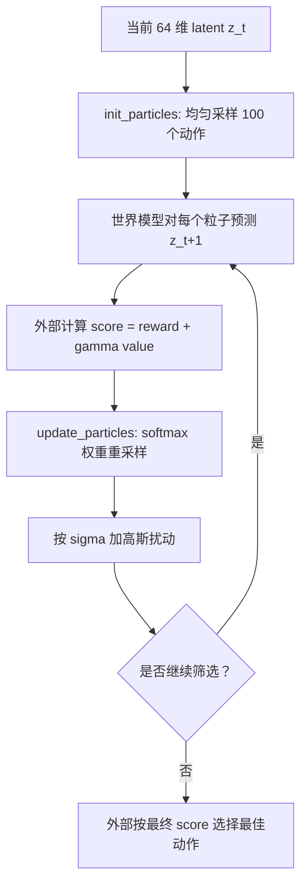

# 粒子策略

`utils.particle_policy.ParticlePolicy` 只负责 `Pendulum-v1` 动作粒子的生成和更新，
不包含 encoder、transition、reward 或 value 模型。世界模型代码负责预测每个粒子的
分数，策略只用这些分数执行重采样与扰动。

`init_particles(batch_size, ...)` 返回形状 `(B, 100, 1)` 的均匀动作粒子，范围固定为
Pendulum-v1 的 `[-2, 2]`。`update_particles(particles, scores, sigma=...)` 接收相同批次的
粒子和形状 `(B, 100)` 的分数，通过 `softmax(scores)` 形成重采样权重，再为每个重采样
粒子加入高斯噪声。省略 `sigma` 时标准差为 `0.1`；`sigma=0.0` 只重采样、不扰动。



分数是候选动作的排序分数，并不表示概率；`softmax` 仅用于构造非负、归一化的重采样权重。
多轮循环和最终最佳粒子选择由调用方执行，因此可以按世界模型的实际接口决定如何计算
`reward(z_t, a_t, z_{t+1}) + gamma * value(z_{t+1})`。

## 用法

```python
import torch

from utils.particle_policy import ParticlePolicy

policy = ParticlePolicy()
particles = policy.init_particles(
    batch_size=latent.shape[0],
    device=latent.device,
    dtype=latent.dtype,
)

for _ in range(4):
    scores = score_particles(latent, particles)  # (B, 100)
    particles = policy.update_particles(particles, scores, sigma=0.1)

scores = score_particles(latent, particles)
best_indices = scores.argmax(dim=1)
action = torch.gather(particles, 1, best_indices[:, None, None]).squeeze(1)
```

`score_particles` 应为每个粒子计算 `reward + gamma * value`，并返回有限的浮点分数。
