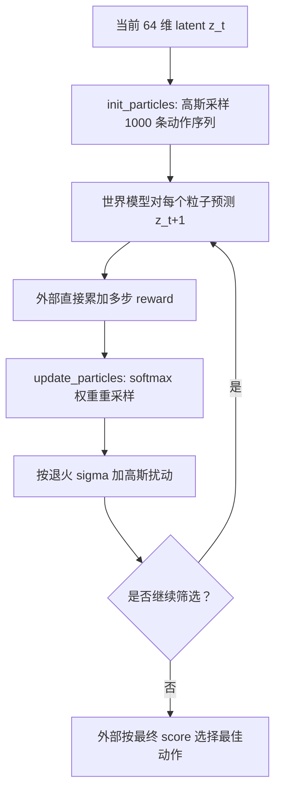

# 粒子策略

`utils.particle_policy.ParticlePolicy` 只负责 `Pendulum-v1` 动作粒子的生成和更新，
不包含 encoder、transition 或 reward 模型。世界模型代码负责预测每个粒子的
分数，策略只用这些分数执行重采样与扰动。

`init_particles(batch_size, ...)` 返回形状 `(B, 1000, H, 1)` 的高斯动作序列。每个时间步独立使用动作范围中心
`(min + max) / 2` 作为均值、`(max - min) / 4` 作为标准差，采样后裁剪到合法范围。Pendulum-v1 对应
`Normal(0, 1)` 并裁剪到 `[-2, 2]`。`update_particles(particles, scores, sigma=...)` 接收相同批次的
粒子和形状 `(B, 1000)` 的分数，通过 `softmax(scores / temperature)` 形成重采样权重，再为每个重采样
粒子加入高斯噪声。`temperature` 必须为正，默认是 `2.0`；较小的值增强选择压力，较大的值让重采样更均匀。

第 `i` 次更新使用：

```text
sigma_i = max(1 / horizon, sigma_initial - i / horizon)
```

因此 sigma 每轮减少 `1 / horizon`，到达 `1 / horizon` 后不再下降。如果初始值低于该下限，实际 sigma 从第一轮起就是 `1 / horizon`。



分数是候选动作的排序分数，并不表示概率；`softmax` 仅用于构造非负、归一化的重采样权重。
多轮循环和最终最佳粒子选择由调用方执行，因此可以按世界模型的实际接口决定如何计算
多步 `reward(z_t, a_t)`。

## 用法

```python
import torch

from utils.particle_policy import ParticlePolicy

policy = ParticlePolicy()
particles = policy.init_particles(
    batch_size=latent.shape[0],
    device=latent.device,
    dtype=latent.dtype,
)

for update in range(5):
    scores = score_particles(latent, particles)  # (B, 1000)
    sigma = max(1 / policy.horizon, 0.1 - update / policy.horizon)
    particles = policy.update_particles(
        particles,
        scores,
        sigma=sigma,
        temperature=2.0,
    )

scores = score_particles(latent, particles)
best_indices = scores.argmax(dim=1)
action = torch.gather(particles, 1, best_indices[:, None, None]).squeeze(1)
```

`score_particles` 为每个动作序列直接累计 reward，不使用折扣或 terminal value，并返回有限的浮点分数。

## 与 MPPI、CEM 的区别

当前实现更接近带 mutation 的序贯蒙特卡洛（SMC）或进化搜索，不是标准 MPPI：

| 项目 | 当前 ParticlePolicy | 标准 MPPI | 标准 CEM |
| --- | --- | --- | --- |
| 候选更新 | 按 `softmax(score / temperature)` 有放回复制整条序列 | 对 nominal sequence 的采样噪声做指数加权平均 | 选 top-k elite，重估采样分布 |
| 搜索分布 | 以动作范围中心为均值的高斯采样后裁剪，之后使用退火 `sigma` 扰动 | nominal sequence 周围的噪声分布 | 通常是逐时间步高斯均值和方差 |
| 选择强度 | temperature 显式控制 softmax 选择压力 | temperature `lambda` 显式控制 | elite fraction 显式控制 |
| 方差 | 按 horizon 退火，不从样本自适应 | 通常固定或预设噪声协方差 | 每轮按 elite 自适应收缩 |
| 输出 | 最终最高分序列的第一个 action | 更新后 nominal sequence 的第一个 action | 最终均值或最佳序列的第一个 action |
| 跨控制步 | 每步重新按中心高斯初始化 | 通常 shift 上一步 nominal sequence | 通常 shift 上一步分布 |

它与 MPPI 都使用指数权重，但当前实现做离散祖先重采样，而 MPPI 做加权控制更新；
它与 CEM 都会让搜索集中到高分区域，但当前实现没有 elite 集合，也没有拟合均值和方差。

## 10-step horizon

唯一的 `PLANNING_HORIZON` 默认为 10，并同时控制 world-model 递归训练和粒子规划。规划器对 10 步预测 reward 直接求和；训练器对同样 10 步内的有效预测 loss 等权归一化。每轮 sigma 减少 `1/10`，最低保持为 `1/10`。

默认使用 1000 个粒子和 5 次 update；两者分别由 `NUM_PARTICLES` 和 `PARTICLE_UPDATES` 配置，与 horizon 无关。Temperature 默认是 2。若 `softmax(sum_reward / temperature)` 的有效样本数明显下降，可提高 temperature；当前策略仍然没有上一轮序列左移 warm start，也不拟合 CEM 式均值和方差。
